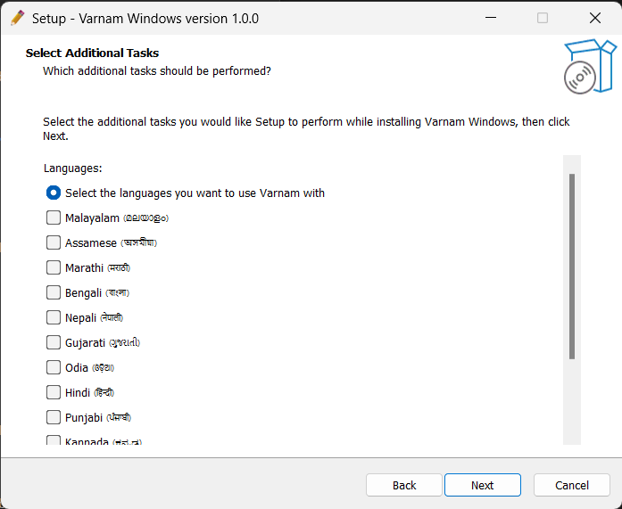

# VarnamIME for Windows

Easily type Indian languages on Windows using [Varnam transliteration engine](https://varnamproject.github.io/).

> This project is a hard-fork of [ime-rs](https://github.com/saschanaz/ime-rs) extended to support plugging [Varnam](https://github.com/varnamproject/govarnam) as the transliteration engine on native Windows IME.

### Installation

Download the latest executable "Varnam-Windows-Install.exe" from [Releases](https://github.com/varnamproject/varnam-windows/releases).

> [!NOTE]
Running the setup executable will prompt you for `Administrator` permissions, this is required to register Varnam as an IME service.

The Setup Wizard will guide you through choosing the installation path, choosing languages, and setting the IME environment up.

<div align="center">



</div>

## Build

**Prerequisites:**
- Windows 64 bit
- [Visual Studio](https://visualstudio.microsoft.com/downloads/) (Including command-line utils: `lib.exe` and `gendef.exe`)
- [Rust](https://www.rust-lang.org/) and [Cargo](https://doc.rust-lang.org/cargo/getting-started/installation.html)
- [Go](https://go.dev/)
- [msys64](https://www.msys2.org/)
- [PowerShell](https://www.microsoft.com/store/productId/9MZ1SNWT0N5D)

### Setup:

**1.** Open the project **Varnam Windows** by opening the file `cpp\VarnamWindows.sln` in Visual Studio.

**2.** Build and compile the bundle:

```
Build -> Build Varnam Windows
```

This should:
1. Build Govarnam, Rust native IME, and the SampleIME-cpp in sequence.
2. Build the necessary DLL, LIB, and PDB files into the `varnam-windows\cpp\x64\Debug` directory.
3. Fetch the latest language schemes from https://github.com/varnamproject/schemes.
4. Import words from the VLF files into the language schemes.
5. Setup language choice configuration.

**3.** Open "Command Prompt" as Administrator, navigate to `varnam-windows\cpp\x64\Debug` and register the DLL to install Varnam as the native IME for the supported languages.

```
regsvr32 "Varnam Windows.dll"
```

To unregister the DLL, run:

```
regsvr32 /u "Varnam Windows.dll"
```

**4.** Compile the `varnam-windows.iss` using [Inno Setup](https://jrsoftware.org/isinfo.php) to package and generate the Varnam Setup Wizard (`Varnam Windows Install.exe`).

---